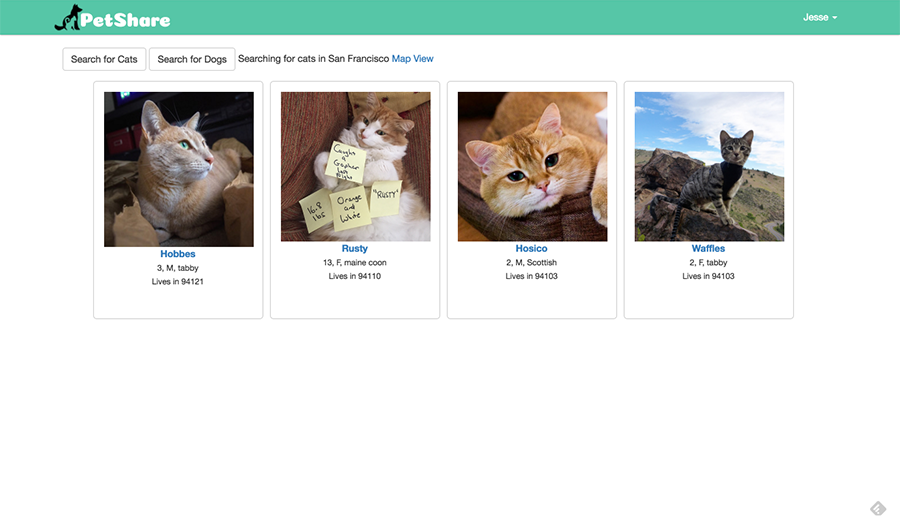
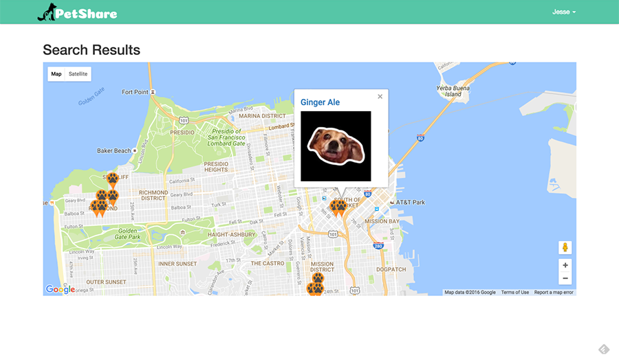
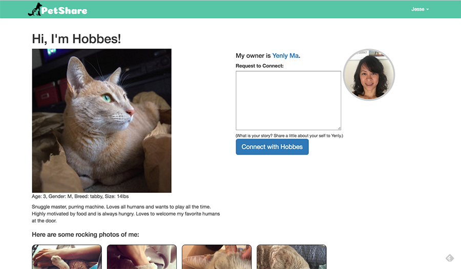

PetShare - Find your furry BFF!
--------

### Description

PetShare is a web app that helps connect pet seekers to pet owners to share quality time and love of a pet. Do you have a job which involves traveling most of the time? Yenly loves to travel and is always on the go. She felt guilty about leaving her cat, Hobbes, behind and was concerned about his happiness with sitters. Because becoming a pet owner changed her quality of life, she wanted to share these experiences with others.


### How it works
Pet seekers can log in and search through the database of available pets to connect with in their city. Pet seekers can submit a connection request to the owner of a desired pet. Pet owners will received email and text notification when they received requests for connection. Pet owners can view pet seeker profiles and evaluate who would be a good fit for their pet.

#### Search Results



#### Search Results on Google Maps



#### Pet Profile




### Technology Stack

**Application:** Python, Flask, Jinja, PostgresSQL, SQL/SQLAlchemy
**APIs:** Google Map, Twilio
**Front-End:** HTML/CSS, Bootstrap, JQuery, Angularjs, JavaScript, AJAX

### Testing Coverage


### How to run PetShare locally

Create a virtual environment

```
> virtualenv env
> source env/bin/activate
```

Install the dependencies

```
> pip install -r requirements.txt
```


In a new Terminal run App
```
> python server.py
```


Open your browser and navigate to

```
http://localhost:5000/
```

Note: Google Map will require an API key. The messaging functionality requires that you have a Twilio account id, authorization token and phone number set as local environment variables:

```
TWILIO_ACCOUNT_SID
TWILIO_AUTH_TOKEN
TWILIO_NUMBER
```

### Future Features
* Allow for safe communication between pet seeker and owner during vetting stage using Twilio masked phone number api - TXT/Voice communication available for a week.
* Once seeker and owner is connected, scheduling component to help manage care for pet

## About the Developer

#### Yenly Ma
[LinkedIn] (https://www.linkedin.com/in/yenlyma)